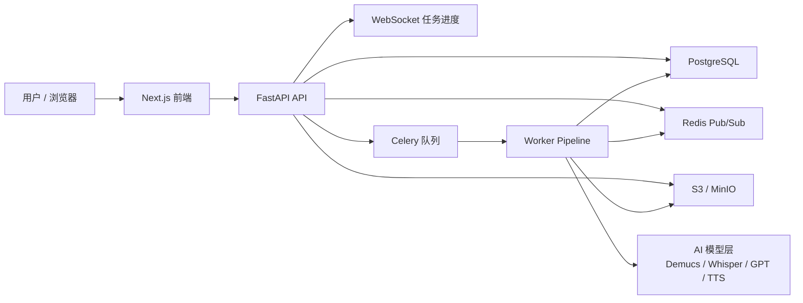

# PodFlow 项目介绍

> 用于个人网站项目详情页展示的 Markdown 文案。
> 
> 说明：以下内容优先基于当前仓库、README、代码结构与最近提交整理；涉及业务结果的部分，明确区分为“已交付能力”与“可作为目标/对外口径补充”的内容，避免夸大。

---

## 一、项目概览

- **项目名称**：PodFlow
- **一句话介绍**：将英文播客自动处理为可播放、可下载、可追踪进度的中文播客成品。
- **项目类型**：AI Code / Workflow Automation
- **所属行业 / 业务场景**：AI 音频内容处理、播客本地化、多媒体工作流自动化
- **项目状态**：开发中（已完成内测 MVP，可进行 Demo 演示，持续迭代中）
- **负责人 / 团队**：个人项目，AI 协作开发
- **首次成型时间**：2026-04-05
- **最近更新时间**：2026-04-28

### 项目简介

PodFlow 是一个面向播客翻译场景的端到端 AI 工作流项目。用户上传英文播客音频后，系统会通过异步流水线完成音源处理、语音识别、翻译、语音合成、时间对齐与结果回传，并在前端实时展示任务进度，最终输出可试听、可下载的中文音频结果。

当前仓库已经具备从登录、上传、创建任务、异步处理、实时进度回传到结果播放/下载的 MVP 闭环，同时提供 Mock Pipeline 以支持本地演示、CI 校验与公开 Demo 环境。

---

## 二、项目背景

### 为什么要做这个项目

优质英文播客内容越来越多，但中文用户获取这类内容仍存在明显门槛。传统方案往往停留在“字幕翻译”或“文本翻译”层面，不能满足播客这种以“听”为核心的消费方式；而人工翻译加配音的流程成本高、周期长，也不适合高频内容生产。

### 业务痛点

- 英文播客理解门槛高，用户无法高效消费海外优质内容。
- 仅提供文字翻译会破坏播客“边走边听”的使用体验。
- 人工翻译与人工配音成本高，难以规模化。
- 多阶段 AI 音频处理链路长，普通用户很难自己搭建和串联。

<!-- ### 原有流程 / 原有开发方式的问题

- 流程割裂：下载音频、转写、翻译、配音、混音通常分散在多个工具中。
- 反馈滞后：长任务缺乏实时状态感知，用户体验不透明。
- 交付不稳定：失败原因、重试机制、额度回退等工程能力不足时，很难做成可展示产品。
- 本地验证困难：真实 AI 依赖重、GPU 要求高，不利于快速演示与 CI。 -->

### 目标用户

- 希望高效获取海外播客内容的中文用户
- 做播客搬运、二创、内容研究或知识整理的创作者 / 团队
- 需要验证 AI 音频工作流产品化路径的项目方

### 期望解决的核心问题

用一个完整、可视化、可部署的 AI 工作流，把“英文播客处理成中文播客成品”从复杂实验流程，变成可直接体验的产品能力。

---

## 三、项目目标与成功标准

### 项目目标

- 打通播客翻译的端到端 MVP 闭环
- 让用户无需理解底层模型与音频工程细节，也能完成任务提交与结果获取
- 将“AI 能力演示”升级为“可运行的产品型 Demo”
- 为后续接入真实模型、优化质量、扩展商业化场景打下工程基础

### 当前阶段的成功标准

- 用户可完成登录、上传、创建任务、查看进度、播放结果、下载结果的完整流程
- 系统支持异步任务处理，不阻塞前端交互
- 长任务具备实时进度反馈，失败时可看到错误信息
- 支持 Demo 模式与真实 Pipeline 模式切换
- 支持容器化部署，能用于本地演示、内测环境或公开 Demo 环境

---

## 四、解决方案介绍

### 方案摘要

PodFlow 将原本分散的 AI 音频处理步骤封装为统一任务流水线：前端负责上传与任务管理，后端负责任务编排与状态持久化，Worker 负责执行各阶段处理，Redis 负责跨进程进度消息总线，对象存储负责音频与产物管理，最终由前端实时展示任务变化并提供结果消费入口。

### 核心能力

- 播客翻译任务创建与异步执行
- 实时任务进度追踪
- 失败信息可视化与额度回退
- 结果试听与下载
- Demo / 真实 AI 流水线双模式
- 面向部署的 API、前端、Worker 分层架构

### 关键功能模块

- 用户认证：支持短信登录与 Demo 登录
- 上传入口：本地音频上传
- 任务中心：任务创建、任务列表、详情页查看
- 进度系统：WebSocket 实时推送 + 轮询兜底
- 异步处理：Celery Worker 执行多阶段 Pipeline
- 结果交付：音频播放、下载、任务状态留痕
- 配额机制：月度额度、消耗、失败退款
- 部署支持：Docker Compose、Nginx、演示/生产环境拆分

### 使用的 AI 能力 / 自动化能力

- 音源分离：Demucs
- 说话人相关处理：PyAnnote
- 语音识别：Faster-Whisper / SenseVoice
- 文本翻译：OpenAI GPT / DeepSeek
- 语音合成 / 克隆：CosyVoice / Fish Speech
- 时间对齐与最终混音：自定义 Pipeline Stage
- 工作流自动化：异步任务队列、阶段编排、状态写回、对象存储、实时消息分发

### 与传统方案相比的差异

- 不是“单点 AI 工具”，而是完整业务流程编排
- 不是“只给翻译文本”，而是直接交付可播放音频结果
- 不是“脚本级实验”，而是具备登录、额度、任务状态、失败处理、部署能力的产品化 MVP
- 不是“只能在高配环境跑”，而是提供 Mock 模式降低演示与验证门槛

---

## 五、业务流程 / 使用流程

### 使用前输入 / 前置条件

- 用户具备可上传的播客音频文件
- 系统已完成基础部署
- Demo 场景可使用 Demo 登录；正式场景可使用短信登录

### 主要流程步骤

1. 用户登录系统
2. 上传本地音频并创建任务
3. 后端记录任务并投递给异步 Worker
4. Worker 按阶段执行 Pipeline
5. 任务详情页实时展示当前阶段、进度与状态
6. 处理完成后生成可播放、可下载的结果音频

### 输出结果

- 中文播客音频结果
- 任务状态记录
- 阶段进度信息
- 失败原因信息（如异常中断）

### 异常情况处理

- 任务失败时，前端展示错误信息
- Worker 会将失败状态与错误消息写回数据库
- 配额消耗失败可进行退款回滚
- WebSocket 不可用时，由前端轮询兜底同步状态

### 人工介入点

- 当前 MVP 主要面向自动化闭环
- 真实生产化阶段可扩展人工校对、术语修订、重生成等环节
- 模型质量、参数策略与业务规则仍需要人工配置和持续调优

---

## 六、技术实现

### 技术架构图

### 核心技术栈

- 前端：Next.js 15、React 19、TypeScript、Zustand
- 后端：FastAPI、SQLAlchemy、Pydantic Settings
- 异步任务：Celery
- 数据与缓存：PostgreSQL、Redis
- 对象存储：MinIO / S3 Compatible Storage
- 部署：Docker Compose、Nginx
- 测试：Pytest

### 依赖的平台 / 工具 / 模型

- OpenAI / DeepSeek：翻译能力
- Faster-Whisper / SenseVoice：语音识别
- Demucs：音源分离
- PyAnnote：说话人相关处理
- CosyVoice / Fish Speech：语音合成 / 音色相关能力

### 数据来源与系统对接方式

- 输入数据：用户上传的本地音频文件
- 存储方式：上传文件与处理结果存放于 S3 / MinIO
- 处理协作：API 创建任务，Worker 拉取任务执行，Redis 广播进度，前端订阅状态
- 对外交付：前端页面提供播放与下载链接

### 安全、权限、日志、监控机制

- 身份认证：支持短信登录 / Demo 登录
- 权限控制：任务与用户身份绑定
- 状态持久化：任务状态、阶段、错误信息写入数据库
- 日志机制：后端与 Worker 有生命周期日志输出
- 容错机制：失败写回、轮询兜底、额度退款
- 当前限制：监控与告警体系已具备基础可扩展点，但尚未形成完整生产级观测平台

---

## 七、项目价值

### 提效点

- 把多工具串联的音频处理流程集中到一个系统里
- 用异步工作流承载长任务，减少人工盯流程成本
- 用 Demo 模式大幅降低团队验证和演示成本

### 成本优化

- 用统一平台替代多工具手工协作
- 通过可切换的 Mock / Real Pipeline 模式降低开发期 GPU 与外部模型调用成本
- 通过配额控制避免资源滥用

### 质量提升

- 每个任务都有结构化状态、阶段和错误信息
- 结果交付链路完整，避免“只跑通模型、没做产品闭环”
- WebSocket + 持久化设计提升了长任务可用性和可解释性

### 风险降低

- Mock Pipeline 支持在无重型 AI 依赖时完成联调与 CI
- 失败时能够回传错误而不是静默中断
- 演示环境与生产环境拆分，降低误用风险

### 可量化结果

当前仓库中已可确认的工程结果：

- 已完成端到端 MVP 闭环
- 已支持本地 Demo 启动与容器化部署
- 已包含 35 个测试文件，用于单元、集成与端到端验证
- 已形成公开演示与生产部署分离的基础结构

如需对外展示业务价值，可使用更稳妥的表述方式：

- 将原本分散的播客翻译流程收敛为单一产品流程
- 将“实验型 AI 能力”推进为“可演示、可部署、可迭代”的项目形态
- 为后续统计节省时长、降低错误率、提升交付效率建立了可测量基础

---

## 八、交付内容

### 当前已交付

- Web 前端：登录页、首页上传区、任务列表、任务详情、个人资料页
- 后端 API：认证、用户、任务、健康检查、WebSocket 实时任务通道
- 异步 Worker：Pipeline 任务处理与状态写回
- 存储与中间件接入：PostgreSQL、Redis、MinIO / S3
- 容器化部署方案：本地、Demo、生产三类运行方式
- 测试与迁移：Pytest、Alembic Migration

### 可归类为交付成果的内容

- 页面 / 系统：PodFlow Web 应用
- 接口或集成项：认证接口、任务接口、实时进度接口、对象存储接入
- 配置文档：README、部署环境说明、架构与设计文档
- 操作手册：本地启动、环境变量、部署说明、验收清单
- 培训支持：当前适合通过 Demo 流程进行演示讲解
- 后续维护范围：功能迭代、真实模型接入、质量优化、稳定性增强、观测体系建设

---

## 九、案例演示

### 现有可用展示素材

- 登录页截图
- 首页上传页截图
- 任务列表截图
- 个人资料页截图
- 多端适配截图（Desktop / Tablet / Mobile）
- 产品流程图素材：`PodFlow_PD.png`

### 建议在网站中展示的素材位置

- 首页 Hero 区：一句话介绍 + 首页上传页截图
- 功能说明区：任务详情进度流转示意
- 项目成果区：任务列表页、个人中心页、移动端截图
- 技术实现区：架构图或处理流程图

### 仓库中已有的截图文件

- `brain/screenshots/login_desktop.png`
- `brain/screenshots/login_mobile.png`
- `brain/screenshots/homepage_desktop.png`
- `brain/screenshots/homepage_tablet.png`
- `brain/screenshots/homepage_mobile.png`
- `brain/screenshots/tasks_desktop.png`
- `brain/screenshots/profile_desktop.png`
- `PodFlow_PD.png`

### before / after 对比建议

- Before：用户需要手动下载音频、转写、翻译、配音、导出
- After：用户登录后上传音频，系统自动完成任务处理并返回可播放结果

### 典型使用场景

- 将海外科技播客快速转换为中文可听版本
- 用于内容研究、二创选题、播客样例验证
- 作为 AI 音频工作流产品化 MVP 对外演示

---

## 十、适用范围与限制

### 适用业务场景

- AI 音频处理产品原型验证
- 播客翻译与本地化 Demo
- 多阶段 AI Workflow 产品化展示
- 需要“前后端 + 异步任务 + 实时进度 + 结果交付”完整案例的作品集场景

### 不适用场景

- 对大规模生产稳定性、SLA、计费闭环有严格要求的正式商业环境
- 对翻译质量、音色保真和多说话人复杂场景有极高要求的成熟生产业务
- 需要完整人工校对工作台、复杂审核流、企业级审计能力的场景

### 使用前提

- 需要具备基础部署环境
- 若启用真实 Pipeline，需要安装额外 AI 依赖，部分能力可能依赖 GPU
- 若用于公网体验，需要配置可访问的对象存储公网地址

### 依赖条件

- PostgreSQL
- Redis
- S3 / MinIO
- Docker / Docker Compose
- 外部模型服务或本地模型运行环境

### 当前版本限制

- 当前默认主流程以 Mock Pipeline 为主，真实 AI 流水线为可选模式
- 输入方式当前以本地音频上传为主
- 完整的人工校对工作台尚未正式交付
- 生产级监控、告警、弹性扩缩与商业化能力仍在后续规划中

---

## 十一、FAQ / 下一步行动

### 常见问题

**Q1：这个项目现在是概念，还是已经能运行？**  
A：已经不是纯概念，当前仓库已具备可运行的 MVP 闭环，并支持 Demo 部署。

**Q2：现在默认跑的是真实 AI 流水线吗？**  
A：默认是 Mock Pipeline，用于本地验证、CI 和演示；真实 AI 流水线可以通过配置切换启用。

**Q3：这个项目的亮点是什么？**  
A：亮点不只是模型接入，而是把上传、任务编排、异步处理、实时状态、失败处理和结果交付完整串成了产品流程。

**Q4：是否适合直接投入生产？**  
A：现阶段更适合作为内测 MVP、作品集展示和产品验证底座，离大规模生产化仍有进一步建设空间。

### 实施周期

- 作为 Demo / 作品集展示：可直接基于当前版本部署
- 作为可控内测版本：需要继续补充真实模型配置、质量调优与运维能力
- 作为生产候选版本：建议增加监控告警、权限细化、计费体系、人工校对与弹性扩缩支持

### 报价方式 / 资源投入

如果此项目用于个人网站展示，建议对外口径写为：

- 可按 MVP 定制开发评估
- 可按功能模块拆分评估
- 资源投入通常取决于模型选型、部署环境、并发需求与结果质量要求

### 如何申请试用 / 咨询 / 立项

建议在个人网站中放置以下 CTA：

- 申请项目演示
- 咨询 AI 工作流定制
- 预约技术方案评估
- 获取项目源码讲解 / 架构拆解

---

## 十二、适合直接放到网站顶部的精简版文案

**PodFlow** 是一个面向播客翻译场景的 AI 工作流项目，用于将英文播客自动处理为可播放、可下载的中文音频结果。项目以“前端体验 + 后端编排 + 异步任务 + 实时进度 + 结果交付”的完整产品闭环为核心，既能展示 AI 模型能力，也能体现工程化落地能力。

当前版本已完成内测 MVP，支持登录、音频上传、任务创建、实时进度追踪、结果播放下载，以及 Demo / Real Pipeline 双模式切换，适合作为 AI 音频产品原型、工作流自动化案例和个人作品集展示项目。

---

## 十三、可替换信息建议

发布到个人网站前，建议按你的实际情况替换以下字段：

- 负责人 / 团队
- 是否写“个人项目”还是“团队项目”
- 是否公开 Demo 链接
- 是否补充真实业务数据或用户反馈
- 是否展示你在项目中的职责边界（产品、架构、前后端、AI 集成、部署）

