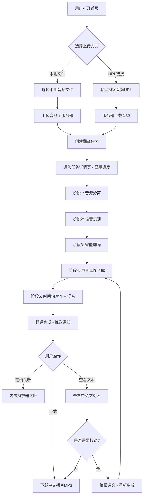
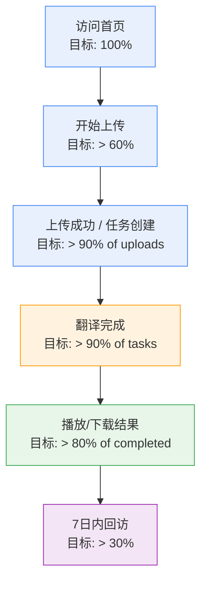
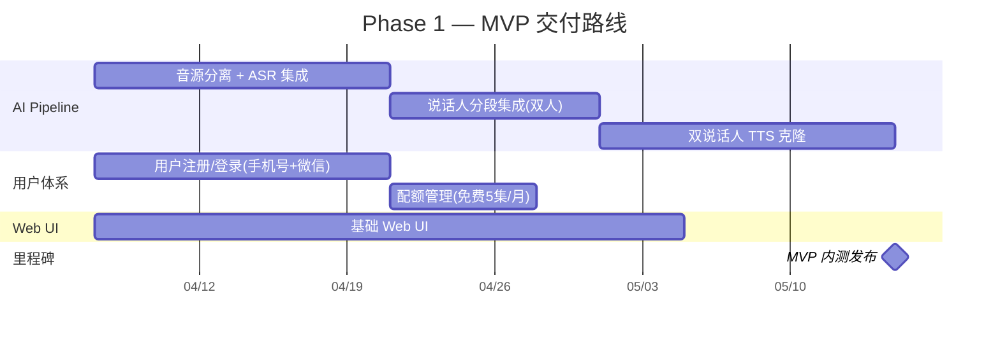

# 🎙️ 播客翻译产品需求文档（PRD）

> **设计历史**：本文记录早期产品决策，旧名称 PodCast Translator 是 PodFlow 的历史名称。内容可能与当前实现不同；现行运行说明以 [README.md](README.md) 为准。
>
> **产品名称**：PodCast Translator（暂定）
> **文档版本**：v1.1
> **撰写日期**：2026-04-05
> **最后更新**：2026-04-06
> **产品经理**：资深产品经理
> **关联文档**：[架构设计方案（SAD）](./PROJECT_SAD.md) | [架构规范（ADS）](./PROJECT_ADS.md)

---

## 一、需求背景与目标

### 1.1 为什么要做这个产品？

**市场背景**：
- 全球英文播客内容呈爆发式增长（Apple Podcasts 超 500 万档节目），但中文用户因语言壁垒，无法高效消费优质英文播客内容。
- 现有字幕翻译/文本翻译方案无法满足播客"用耳朵听"的核心场景——用户需要的是**一条可以直接听的中文播客**，而非看翻译文本。
- AI 语音克隆技术（如 CosyVoice 2）已达到商用水准，跨语言声音克隆从"不可能"变为"可落地"。

**核心痛点**：

| 痛点 | 现有解决方案 | 问题 |
|------|-------------|------|
| 听不懂英文播客 | 看文字翻译/字幕 | 失去播客"解放双眼"的核心价值 |
| 机器翻译生硬 | 通用 TTS 朗读译文 | 机械感强，无原主播人格魅力 |
| 翻译效率低 | 人工翻译+配音 | 成本极高（数千元/集），时效性差（周级别） |

**产品机会**：用 AI 实现"端到端"的播客翻译——上传英文播客音频，输出保留原主播音色的中文播客音频，将成本从数千元降至 10 元级别，时效从周级别压缩至 30 分钟级别。

### 1.2 阶段性目标

本产品处于 **0→1 阶段**，按技术交付里程碑分为五个阶段（与架构设计方案 SAD 5.3 对齐）：

```markmap
# 阶段性目标

## Phase 0 - 项目初始化 ✅ 已完成
- 技术选型与架构规范确立（ADS）
- 项目目录结构搭建、ORM 基类、Repository 基类、Pipeline 上下文
- 三文档体系（PRD / SAD / ADS）对齐

## Phase 1 - MVP 验证（单/双人播客）
- 核心验证：端到端翻译链路跑通，翻译质量达到"可听"水准
- 功能范围：音源分离 + ASR + 翻译 + 声音克隆TTS + 混音 + 用户体系 + 基础 Web UI
- 拉新目标：种子用户 500 人（播客重度用户 + 英语学习者）
- 核心指标：任务完成率 > 90%，用户满意度 > 3.5/5

## Phase 2 - 体验优化
- 多说话人支持（3-5人对话播客）
- 时间轴对齐优化 + 背景音分离与混音
- 中英文校对编辑 + 校对后重新生成
- 翻译质量提升至"好听"水准
- 促活目标：周活跃率 > 40%

## Phase 3 - 生产强化
- GPU 弹性伸缩（K8s + KEDA）
- 降级策略与限流（TTS/翻译多级降级）
- 可观测性与质量监控（OpenTelemetry + Grafana）
- 人工校对工作流

## Phase 4 - 商业化与多语种
- 付费订阅系统，付费转化率 > 5%
- 支持更多语种（日语、韩语等）
- 开放 API 给第三方播客平台
- 播客 RSS 自动订阅翻译
```

---

## 二、用户画像与场景故事

### 2.1 核心用户画像

| 维度 | 画像 A：知识饥渴型 | 画像 B：英语学习型 | 画像 C：内容创作者 |
|------|-------------------|-------------------|-------------------|
| **典型人物** | 张明，32岁，互联网产品经理 | 李雪，24岁，考研/留学备考生 | 王磊，28岁，播客主播/自媒体人 |
| **核心诉求** | 通勤路上高效获取硅谷前沿信息 | 用"听"的方式辅助英语学习 | 引进海外优质内容做二创 |
| **使用频率** | 每周 3-5 次，每次 30-60 分钟 | 每天 1 次，每次 15-30 分钟 | 每周 1-2 次，每次处理整集 |
| **付费意愿** | 中高（愿为效率付费） | 中（预算有限但刚需） | 高（可计入创作成本） |
| **关键痛点** | 英语听力有限，看文字翻译太累 | 想对照中英文学习，但找不到好资源 | 人工翻译配音太贵太慢 |

### 2.2 场景故事

#### 场景一：通勤路上的张明

> 周一早上 8:15，张明挤上北京地铁 13 号线。他刚在 X（Twitter）上看到 Lex Fridman 发布了一期与 Sam Altman 的深度对话，长达 2 小时。他很想听，但自己的英语水平只能听懂 60%，而且地铁太吵根本无法集中注意力听英文。
>
> 他打开 **PodCast Translator**，粘贴了这期播客的音频链接。App 显示"预计 25 分钟完成翻译"。等他到公司泡好咖啡，手机推送："您的播客翻译已完成 ✅"。他戴上耳机，听到的是 Lex Fridman 和 Sam Altman 用"他们自己的声音"说着流利的中文——既有原主播的语调特色，又是地道的中文表达。
>
> 张明心想："这比看文字翻译爽多了，就像他们专门录了一期中文版。"

#### 场景二：做内容二创的王磊

> 王磊运营着一档科技播客，粉丝 5 万。他想做一个"硅谷之声"系列，把 a]6z 的播客翻译成中文分享给听众。以前找人工翻译+配音，一集报价 3000 元，还要等 5 天。
>
> 现在他把音频上传到 **PodCast Translator**，30 分钟后拿到初版。他进入"校对模式"，逐段检查译文，修改了几处专业术语的翻译，点击"重新生成"。10 分钟后，一条高质量的中文播客就绪。总成本不到 15 元。
>
> 王磊把成品下载后稍作剪辑，加上自己的开场白，就发布了。评论区粉丝纷纷留言："这个翻译质量也太好了吧，声音居然还是原来的人！"

---

## 三、功能列表与优先级（Kano 模型）

### 3.1 功能全景图

```markmap
# 播客翻译 — 功能全景

## 核心翻译链路
- 音频上传（本地文件/URL链接）
- 英文语音识别（ASR）
- 智能翻译（LLM口语化翻译）
- 声音克隆合成（保留原音色）
- 中文播客音频输出与下载

## 多说话人处理
- 自动识别多个说话人
- 每位说话人独立克隆音色
- 对话节奏保持

## 翻译校对
- 中英文对照查看
- 逐段译文编辑
- 基于校对结果重新生成音频

## 任务管理
- 翻译任务列表
- 实时进度展示
- 历史记录与重新下载

## 音频增强
- 背景音乐/音效保留
- 响度标准化
- 输出格式选择（MP3/AAC）

## 用户体系
- 注册/登录
- 用量配额管理
- 付费订阅
```

### 3.2 Kano 模型优先级排序

| 功能 | Kano 分类 | 优先级 | 阶段 | 说明 |
|------|-----------|--------|------|------|
| 音频上传（本地文件） | 必备属性 | P0 | ✅ Phase 1 | 最基础的入口能力 |
| 英文语音识别 | 必备属性 | P0 | ✅ Phase 1 | 链路核心环节 |
| LLM 口语化翻译 | 必备属性 | P0 | ✅ Phase 1 | 链路核心环节 |
| 声音克隆中文合成 | 必备属性 | P0 | ✅ Phase 1 | **核心差异化卖点** |
| 中文音频下载 | 必备属性 | P0 | ✅ Phase 1 | 用户获取结果的唯一出口 |
| 翻译进度实时展示 | 必备属性 | P0 | ✅ Phase 1 | 长任务必须有进度反馈，否则用户焦虑 |
| 任务历史列表 | 期望属性 | P1 | ✅ Phase 1 | 基础任务管理 |
| URL 链接上传 | 期望属性 | P1 | ✅ Phase 1 | 降低使用门槛（免下载原音频） |
| 多说话人自动识别 | 期望属性 | P1 | ❌ Phase 2 | 技术复杂度高，MVP 先支持单/双人 |
| 中英文对照校对 | 期望属性 | P1 | ❌ Phase 2 | 提升专业用户粘性 |
| 校对后重新生成 | 期望属性 | P1 | ❌ Phase 2 | 依赖校对功能 |
| 背景音乐保留与混音 | 期望属性 | P2 | ❌ Phase 2 | 提升听感，但非核心 |
| 输出格式选择 | 期望属性 | P2 | ❌ Phase 2 | MVP 默认 MP3 即可 |
| 响度标准化 | 期望属性 | P2 | ✅ Phase 1 | 技术实现简单，体验提升明显 |
| 用户注册/登录 | 必备属性 | P0 | ✅ Phase 1 | 任务需绑定用户 |
| 用量配额管理 | 期望属性 | P1 | ✅ Phase 1 | 控制成本，防滥用 |
| 付费订阅 | 期望属性 | P1 | ❌ Phase 4 | MVP 阶段用免费额度验证 |
| 多语种支持 | 魅力属性 | P3 | ❌ Phase 4 | 扩大市场，但非当务之急 |
| API 开放平台 | 魅力属性 | P3 | ❌ Phase 4 | B端商业化路径 |
| 播客订阅自动翻译 | 魅力属性 | P3 | ❌ Phase 4 | 订阅 RSS 后自动翻译新集数 |

---

## 四、PRD 核心输出

### 4.1 业务主流程



### 4.2 核心页面信息架构

#### 页面一：首页 / 上传页

```
┌─────────────────────────────────────────────┐
│  🎙️ PodCast Translator                 [头像] │
│─────────────────────────────────────────────│
│                                             │
│     将英文播客翻译为中文                      │
│     保留原主播声音，像听中文播客一样自然        │
│                                             │
│  ┌─────────────────────────────────────┐    │
│  │                                     │    │
│  │   📁 拖拽音频文件到此处上传           │    │
│  │      或 点击选择文件                 │    │
│  │                                     │    │
│  │   支持 MP3/WAV/M4A，最大 500MB       │    │
│  │                                     │    │
│  └─────────────────────────────────────┘    │
│                                             │
│  ─── 或者 ───                               │
│                                             │
│  🔗 [粘贴播客音频URL                    ] [开始] │
│                                             │
│─────────────────────────────────────────────│
│  📋 最近翻译                                 │
│  ┌──────────────────────────────────────┐   │
│  │ 🎧 Lex Fridman #421    ✅ 已完成  [播放] │   │
│  │ 🎧 All-In Podcast E178  ⏳ 翻译中 68% │   │
│  │ 🎧 The Tim Ferriss Show  ✅ 已完成 [播放] │   │
│  └──────────────────────────────────────┘   │
│                                             │
│  剩余免费额度：3/5 集                        │
└─────────────────────────────────────────────┘
```

**页面模块说明**：

| 模块 | 元素 | 状态/交互 |
|------|------|----------|
| 顶部导航 | Logo + 用户头像 | 点击头像展开菜单（设置/退出） |
| 核心 CTA 区 | 标题 + 副标题 | 传达核心价值主张 |
| 上传区域 | 拖拽区 + 文件选择按钮 | 拖拽高亮态 / 上传中进度条 / 格式错误提示 |
| URL 输入区 | 输入框 + 开始按钮 | URL 校验 / 加载中态 / 无效URL提示 |
| 最近翻译列表 | 任务卡片 × N | 状态：排队中/翻译中(百分比)/已完成/失败 |
| 额度提示 | 剩余额度文案 | 额度不足时变为"升级"引导 |

#### 页面二：任务详情 / 进度页

```
┌─────────────────────────────────────────────┐
│  ← 返回    任务详情                          │
│─────────────────────────────────────────────│
│                                             │
│  🎧 Lex Fridman Podcast #421               │
│  Sam Altman: OpenAI, GPT-5 and ...         │
│  时长: 2:15:30  |  上传于 10 分钟前           │
│                                             │
│  ┌─ 翻译进度 ────────────────────────────┐  │
│  │                                       │  │
│  │  ✅ 音源分离          完成             │  │
│  │  ✅ 语音识别          完成             │  │
│  │  🔄 智能翻译          进行中 72%       │  │
│  │  ⬚ 声音克隆合成       等待中           │  │
│  │  ⬚ 混音输出           等待中           │  │
│  │                                       │  │
│  │  ████████████████░░░░░░░  62%         │  │
│  │  预计剩余时间: 约 8 分钟               │  │
│  └───────────────────────────────────────┘  │
│                                             │
│─────── 翻译完成后显示 ──────────────────────│
│                                             │
│  🔊 [▶ 播放中文版]  ━━━━━━━━○━━━  1:23:45  │
│                                             │
│  [⬇️ 下载 MP3]    [📝 查看中英文对照]        │
│                                             │
└─────────────────────────────────────────────┘
```

**页面模块说明**：

| 模块 | 元素 | 状态/交互 |
|------|------|----------|
| 任务信息头 | 标题 + 时长 + 上传时间 | 静态展示 |
| 进度步骤条 | 5 个阶段 + 总进度条 | 实时更新（WebSocket）；各阶段状态：等待/进行中/完成/失败。**用户侧 5 步与技术侧 7 阶段映射**：①音源分离=技术阶段1；②语音识别=技术阶段2(说话人分段)+3(ASR)；③智能翻译=技术阶段4；④声音克隆=技术阶段5；⑤混音输出=技术阶段6(时间轴对齐)+7(混音) |
| 预计时间 | 剩余时间文案 | 根据历史数据动态估算 |
| 播放器 | 播放/暂停 + 进度条 + 时间 | 仅在完成后显示；支持倍速 |
| 操作按钮 | 下载 + 查看文本 | 仅在完成后可点击 |
| 失败态 | 错误信息 + 重试按钮 | 仅在失败时显示 |

#### 页面三：中英文对照页（二期）

```
┌─────────────────────────────────────────────┐
│  ← 返回    中英文对照    [重新生成音频]       │
│─────────────────────────────────────────────│
│                                             │
│  🔊 [▶ 播放]  ━━━━━━━━○━━━  同步高亮当前段   │
│                                             │
│  ┌─ Speaker A (Lex) ────────────────────┐   │
│  │ EN: So Sam, let's start with the     │   │
│  │     big picture. Where is OpenAI...  │   │
│  │ CN: 那 Sam，我们从大局开始聊吧。       │   │
│  │     OpenAI 现在走到哪一步了...    [✏️] │   │
│  └──────────────────────────────────────┘   │
│                                             │
│  ┌─ Speaker B (Sam) ────────────────────┐   │
│  │ EN: Yeah, I think we're at this      │   │
│  │     really interesting inflection... │   │
│  │ CN: 嗯，我觉得我们正处在一个非常有趣   │   │
│  │     的转折点上...                [✏️] │   │
│  └──────────────────────────────────────┘   │
│                                             │
│  ... 更多段落 ...                            │
└─────────────────────────────────────────────┘
```

### 4.3 核心交互流程与异常处理

| 场景 | 正常流程 | 异常处理 |
|------|---------|---------|
| 文件上传 | 拖拽/选择 → 上传进度条 → 自动创建任务 | 格式不支持：toast 提示支持的格式；文件过大：提示"超过 500MB 限制"；网络中断：断点续传 |
| URL 解析 | 粘贴 URL → 点击开始 → 后端下载 → 创建任务 | URL 无效：输入框下方红字提示；音频无法下载：提示"无法访问该链接，请检查或改用本地上传" |
| 翻译进度 | WebSocket 实时推送各阶段进度 | WebSocket 断连：自动重连 + 轮询兜底；页面刷新：从 DB 恢复状态 |
| 翻译失败 | — | 显示失败原因 + "重试"按钮；3 次重试仍失败：提示联系客服 + 不扣额度 |
| 下载音频 | 点击下载 → 浏览器下载 MP3 | CDN 异常：降级从源站下载 |
| 额度不足 | — | 上传时拦截：弹窗提示"额度已用完" + 引导升级 |

---

## 五、数据埋点与成功评估

### 5.1 核心埋点清单

| 埋点事件 | 事件名 | 关键参数 | 埋点目的 |
|---------|--------|---------|---------|
| 页面访问 | `page_view` | page_name, referrer | 流量来源分析 |
| 点击上传区域 | `upload_area_click` | upload_type: file/url | 了解用户偏好的上传方式 |
| 文件上传开始 | `upload_start` | file_size, file_format, duration | 分析用户上传的音频特征 |
| 文件上传完成 | `upload_complete` | file_size, upload_duration | 上传成功率与耗时 |
| 文件上传失败 | `upload_fail` | error_type, file_size | 定位上传问题 |
| 翻译任务创建 | `task_create` | source_type: file/url, audio_duration | 核心转化事件 |
| 翻译各阶段完成 | `pipeline_stage_complete` | stage_name, duration, task_id | 各阶段耗时监控 |
| 翻译任务完成 | `task_complete` | total_duration, audio_duration | 端到端成功率与效率 |
| 翻译任务失败 | `task_fail` | fail_stage, error_type | 定位失败瓶颈 |
| 播放中文音频 | `audio_play` | task_id, play_duration, total_duration | 用户是否真的在听 |
| 下载音频 | `audio_download` | task_id, format | 核心价值交付确认 |
| 查看中英对照 | `transcript_view` | task_id | 校对功能使用率 |
| 编辑译文 | `transcript_edit` | task_id, segment_id, edit_type | 翻译质量反馈信号 |
| 重新生成 | `regenerate_click` | task_id, edited_segments_count | 校对→重新生成转化 |
| 额度不足拦截 | `quota_limit_hit` | user_id, current_usage | 付费转化机会点 |
| 升级按钮点击 | `upgrade_click` | source_page, trigger_reason | 付费意愿信号 |

### 5.2 核心漏斗



### 5.3 成功指标定义（North Star + 支撑指标）

| 指标层级 | 指标名称 | 定义 | MVP 目标值 | 度量周期 |
|---------|---------|------|-----------|---------|
| 🌟 北极星指标 | **周活跃翻译任务数** | 每周成功完成的翻译任务总数 | 200 任务/周 | 周 |
| 核心体验 | 任务完成率 | 成功完成 / 总创建任务 | > 90% | 日 |
| 核心体验 | 端到端翻译时长 | 从任务创建到完成的平均耗时 | < 30 min（60min播客） | 日 |
| 核心体验 | 用户满意度评分 | 完成后弹出 1-5 星评分 | > 3.5 / 5 | 周 |
| 用户价值 | 音频播放完成率 | 播放时长 / 音频总时长 | > 50% | 周 |
| 用户价值 | 下载率 | 下载次数 / 完成任务数 | > 60% | 周 |
| 增长 | 7 日留存率 | 7 日后回访用户 / 新用户 | > 25% | 周 |
| 增长 | 自然分享率 | 分享行为用户 / 活跃用户 | > 5% | 月 |
| 商业化 | 额度用尽率 | 用完免费额度的用户比例 | > 20% | 月 |
| 质量 | 翻译编辑率 | 使用校对编辑功能的用户比例 | < 30%（越低说明翻译越好） | 周 |

### 5.4 A/B 测试规划

| 测试编号 | 测试假设 | 实验变量 | 核心观测指标 | 优先级 |
|---------|---------|---------|-------------|--------|
| AB-001 | URL 上传比文件上传转化率更高 | 首页默认展示 URL 输入框 vs 文件上传框 | 任务创建转化率 | 一期 |
| AB-002 | 显示预计完成时间能降低等待期间流失 | 有/无预计时间展示 | 任务完成页面的到达率 | 一期 |
| AB-003 | 翻译完成推送通知能提升下载率 | 有/无完成推送 | 下载率 | 一期 |
| AB-004 | 免费额度 3 集 vs 5 集对付费转化的影响 | 免费额度数量 | 付费转化率 + 7日留存 | 二期 |
| AB-005 | 翻译风格选项（严谨/口语/幽默）对满意度影响 | 翻译 prompt 风格 | 满意度评分 + 编辑率 | 二期 |

---

## 六、业务风险评估

| 风险类别 | 具体风险 | 影响程度 | 发生概率 | 应对策略 |
|---------|---------|---------|---------|---------|
| ⚖️ **合规风险** | 播客音频版权问题——翻译他人播客是否构成侵权 | 🔴 高 | 🟡 中 | ① MVP 阶段仅支持用户上传自有内容或获授权内容，TOS 明确免责；② 二期探索与播客平台合作获取授权；③ 法务前置评估各国版权法对"翻译"的定义 |
| ⚖️ **合规风险** | 声音克隆的肖像权/人格权争议 | 🟡 中 | 🟡 中 | ① 仅用于翻译原音频场景，不提供任意声音克隆能力；② 用户协议中声明用途限制；③ 关注各地 AI 声音立法动态 |
| 🧊 **冷启动风险** | 用户不知道该产品存在，初期流量不足 | 🟡 中 | 🟡 中 | ① 在播客社区（小宇宙、即刻、播客相关 Reddit）做种子用户招募；② 提供免费额度降低试用门槛；③ 找 KOL 播客主播合作体验 |
| 📚 **教育成本** | 用户不理解"声音克隆"概念，对结果预期偏差 | 🟡 中 | 🟡 中 | ① 首页放置 30 秒 Demo 对比试听（英文原声 vs 中文克隆）；② 引导语明确设定预期："AI 翻译，非人工翻译" |
| 🎯 **质量风险** | 声音克隆保真度不够，用户觉得"不像" | 🔴 高 | 🟡 中 | ① 选用业界最优模型 CosyVoice 2；② 建立 MOS 评分自动化评估机制；③ 允许用户反馈"声音不像"触发人工复核 |
| 🎯 **质量风险** | 口语化翻译不自然，"翻译腔"严重 | 🔴 高 | 🟡 中 | ① 精调翻译 Prompt，强调口语化；② 提供校对编辑能力；③ 收集用户编辑数据作为翻译质量改进信号 |
| 💰 **成本风险** | GPU 推理成本高，免费模式不可持续 | 🟡 中 | 🔴 高 | ① 免费额度严格控制（5集/月）；② 尽早验证付费意愿；③ 技术侧持续优化（模型量化、Spot Instance） |
| ⏱️ **体验风险** | 翻译耗时过长（>30min），用户失去耐心 | 🟡 中 | 🟡 中 | ① 异步处理 + 完成通知；② 进度条实时反馈降低焦虑感；③ 技术侧并行化优化 |
| 🔧 **技术风险** | 多说话人识别准确率不足，导致声音错乱 | 🔴 高 | 🟡 中 | ① MVP 先支持单/双人场景；② 多人场景标注为"Beta"；③ 允许用户手动标注说话人 |

---

## 七、分阶段交付路线

> 本节与架构设计方案（SAD）第 5.3 节保持一致，统一使用 Phase 编号。

### 7.0 Phase 0 — 项目初始化 ✅ 已完成

| 交付物 | 详细说明 | 状态 |
|--------|----------|------|
| 三文档体系 | PRD / SAD / ADS 完成并对齐 | ✅ |
| 项目目录结构 | 按 ADS 第 3 节规范搭建完整目录树 | ✅ |
| ORM 基类 | `src/models/base.py` — DeclarativeBase | ✅ |
| Repository 基类 | `src/repositories/base.py` — 基础 CRUD | ✅ |
| Pipeline 上下文 | `src/pipeline/context.py` — PipelineContext + TaskStage | ✅ |
| Pipeline 基类 | `src/pipeline/base_stage.py` — StageProcessor 责任链 | ✅ |
| 数据库引擎 | `src/core/database.py` — AsyncSession 工厂 | ✅ |
| 全局配置 | `src/config.py` — Settings + 环境变量 | ✅ |
| JWT 基础 | `src/core/security.py` — Token 签发/验证（待完善） | ⚠️ |

### 7.1 Phase 1 — MVP（单/双人播客）



**功能范围（In Scope）：**

| 功能 | 详细说明 |
|------|---------|
| 本地文件上传 | 支持 MP3/WAV/M4A，最大 500MB |
| URL 链接上传 | 支持主流播客平台音频直链 |
| 单/双人播客翻译 | 英文 → 中文，端到端全自动 |
| 声音克隆 | 保留原说话人音色特征 |
| 实时进度展示 | WebSocket 推送 5 个阶段进度 |
| 在线试听 + 下载 | 内嵌播放器 + MP3 下载 |
| 用户注册/登录 | 手机号（短信验证码） + 微信登录 |
| 免费额度 | 每月 5 集免费 |
| 响度标准化 | 输出音频统一 -16 LUFS |

### 7.2 Phase 2 — 体验优化

| 功能 | 详细说明 | 预估工期 |
|------|----------|----------|
| 多说话人支持（3-5人） | 多人对话播客识别与独立声音克隆 | 14d |
| 时间轴对齐优化 | DTW 算法调优，减少中英语速差异导致的节奏失调 | 10d |
| 背景音分离与混音 | 保留原播客背景音乐/音效并混回最终输出 | 7d |
| 中英文校对编辑 | 富文本编辑器，支持逐段校对译文 | 14d |
| 校对后重新生成 | 基于用户校对结果重新合成音频 | 依赖校对功能 |
| 输出格式选择 | 支持 MP3/AAC 格式切换 | 3d |

### 7.3 Phase 3 — 生产强化

| 功能 | 详细说明 | 预估工期 |
|------|----------|----------|
| GPU 弹性伸缩 | K8s + KEDA 基于队列深度自动扩缩 GPU Pod | 10d |
| 降级与限流 | TTS/翻译多级降级策略 + 令牌桶限流 | 7d |
| 可观测性与质量监控 | OpenTelemetry 全链路 Tracing + Grafana 仪表盘 | 7d |
| 人工校对工作流 | 专业译员审核通道，提升翻译质量下限 | 14d |

### 7.4 Phase 4 — 商业化与多语种

| 功能 | 详细说明 |
|------|---------|
| 付费订阅系统 | 多级会员体系，先验证产品价值再商业化 |
| 多语种翻译 | 支持日语、韩语等更多目标语种 |
| API 开放平台 | B端 REST API，供第三方播客平台集成 |
| 播客 RSS 自动订阅翻译 | 订阅 RSS 后自动翻译新集数 |

---

## 八、附录

### 8.1 技术架构参考

详见 [架构设计方案（SAD）](./PROJECT_SAD.md)，核心处理链路：

```
英文音频 → 音源分离(Demucs) → 说话人分段(pyannote) → ASR(Whisper) → 翻译(GPT-4o) → 声音克隆(CosyVoice 2) → 时间轴对齐 → 混音输出
```

### 8.2 竞品参考

| 竞品 | 形态 | 优势 | 劣势 |
|------|------|------|------|
| ElevenLabs Dubbing | SaaS | 多语种、声音克隆质量高 | 不专注播客场景，价格贵，中文支持一般 |
| Podcastle | SaaS | 播客制作全流程工具 | 无翻译功能 |
| 通义听悟 | SaaS | 语音转文字+翻译 | 只输出文本，不输出翻译后的音频 |
| Rask.ai | SaaS | 视频翻译+配音 | 偏视频场景，播客体验未优化 |

**我们的差异化**：专注"英文播客→中文播客"这一垂直场景，以声音克隆保真度和口语化翻译质量为核心竞争力。

### 8.3 术语表

| 术语 | 解释 |
|------|------|
| ASR | Automatic Speech Recognition，自动语音识别 |
| TTS | Text-to-Speech，文字转语音 |
| Voice Cloning | 声音克隆，基于参考音频复制说话人音色 |
| Diarization | 说话人分段，识别音频中"谁在什么时候说话" |
| LUFS | Loudness Units Full Scale，响度标准单位 |
| MOS | Mean Opinion Score，语音质量主观评分（1-5分） |
| DTW | Dynamic Time Warping，动态时间规整算法 |
