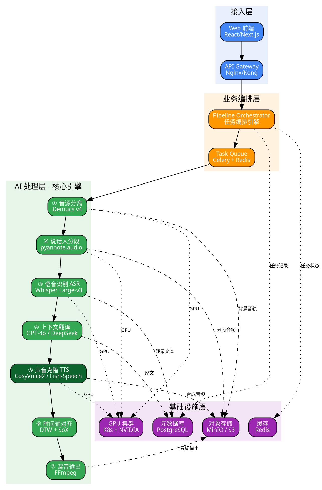
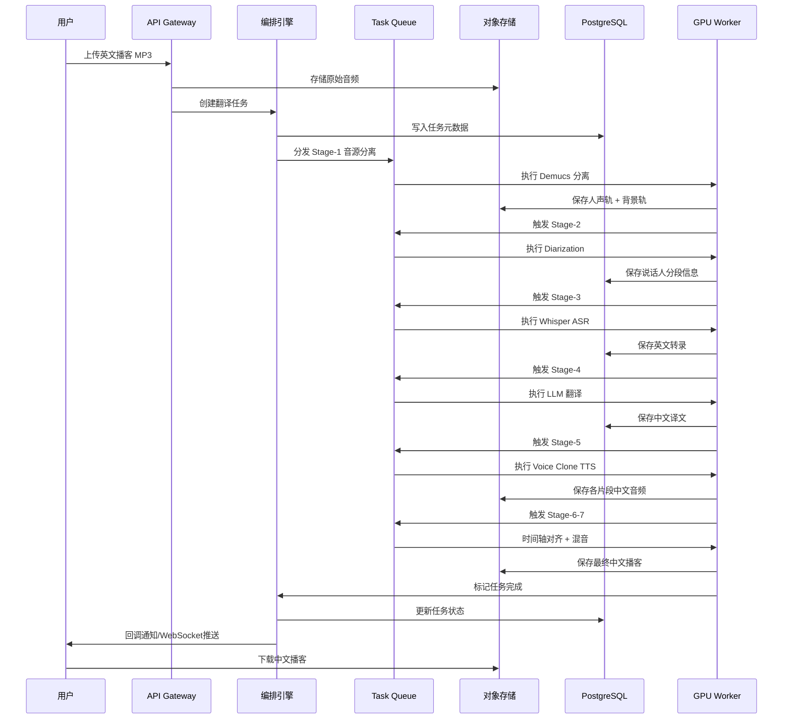
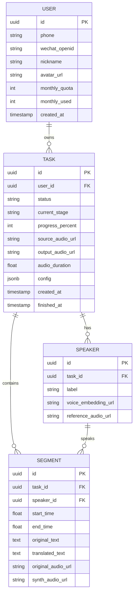
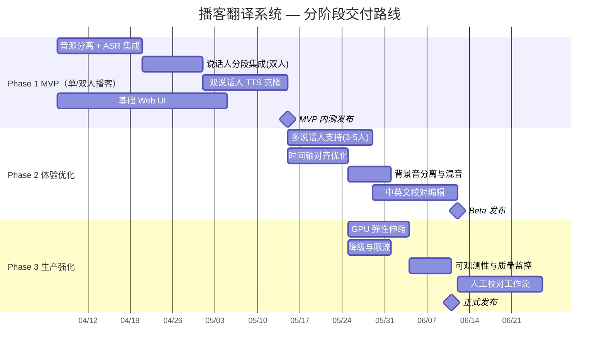

# 🎙️ 播客翻译系统 — 架构设计方案

> **设计历史**：本文保留早期系统方案与选型背景，可能包含已变更的假设。当前架构以 [podcast_translator/ARCHITECTURE.md](podcast_translator/ARCHITECTURE.md) 和代码为准。

---

## 一、需求边界与核心挑战

### 1.1 核心业务目标

> 将英文播客音频 **端到端** 转化为中文播客音频，保留原说话人的音色特征（Voice Cloning），最终交付一条可直接收听的中文播客。

### 1.2 完整业务链路一句话概括

```
英文音频 → 人声/背景分离 → 说话人识别 → 语音转文字 → 翻译 → 声音克隆合成 → 时间轴对齐 → 混音输出
```

### 1.3 六大核心技术挑战

| 挑战 | 难度 | 说明 |
|------|------|------|
| 🗣️ 多说话人识别与分离 | ⭐⭐⭐⭐ | 播客通常 2-5 人对话，需精准区分每个人 |
| 🎭 声音克隆保真度 | ⭐⭐⭐⭐⭐ | 仅凭播客音频片段克隆音色，且要合成中文 |
| 🕐 时间轴对齐 | ⭐⭐⭐⭐ | 中英文语速差异大，需智能伸缩以保持对话节奏 |
| 🎵 背景音乐/音效保留 | ⭐⭐⭐ | 分离人声后需完整保留背景层并最终混回 |
| 📝 翻译自然度 | ⭐⭐⭐⭐ | 口语化播客≠书面翻译，需"说人话" |
| ⏱️ 长音频处理效率 | ⭐⭐⭐ | 播客通常 60-120 分钟，全链路计算量巨大 |

---

## 二、顶层架构设计

### 2.1 架构总览



### 2.2 七大处理阶段详解

```markmap
# 播客翻译 Pipeline

## ① 音源分离 - Source Separation
- Demucs v4 (Meta)
- 输入: 原始混合音频
- 输出: 人声轨 + 背景轨(BGM/音效)
- 目的: 获取干净人声供后续处理

## ② 说话人分段 - Speaker Diarization
- pyannote.audio 3.x
- 输入: 纯人声轨
- 输出: 时间片段列表 + 说话人标签
- 示例: Speaker_A 00:00-00:15, Speaker_B 00:15-00:32

## ③ 语音识别 - ASR
- Whisper Large-v3 / Faster-Whisper
- 输入: 各说话人音频片段
- 输出: 带时间戳的英文转录文本
- 要点: word-level timestamp

## ④ 上下文翻译 - Translation
- GPT-4o / DeepSeek-V3
- 输入: 完整对话上下文英文文本
- 输出: 口语化中文译文
- 要点: 滑动窗口保持上下文连贯

## ⑤ 声音克隆合成 - Voice Clone TTS
- CosyVoice 2 (阿里) / Fish-Speech v1.5
- 输入: 原说话人参考音频 + 中文译文
- 输出: 克隆音色的中文语音
- 要点: 每位说话人独立建模

## ⑥ 时间轴对齐 - Temporal Alignment
- DTW 动态时间规整 + SoX
- 平衡中英语速差异
- 允许合理的静音插入/压缩

## ⑦ 混音输出 - Final Mixing
- FFmpeg + pydub
- 叠加背景音轨
- 响度归一化 (LUFS -16)
- 输出格式: MP3/AAC 可选
```

---

## 三、核心数据流与存储选型

### 3.1 全链路数据流



### 3.2 存储选型矩阵

| 组件 | 选型 | 存储内容 | 选型理由 |
|------|------|----------|----------|
| 对象存储 | **MinIO / AWS S3** | 原始音频、中间音轨、最终输出 | 大文件存储，生命周期管理，CDN 分发友好 |
| 关系数据库 | **PostgreSQL 16** | 任务元数据、转录文本、译文、说话人信息 | 支持 JSONB 存储灵活结构，事务可靠 |
| 缓存/队列 | **Redis 7** | 任务状态、进度百分比、分布式锁 | 高性能读写，支持 Pub/Sub 做进度推送 |
| 任务队列 | **Celery + Redis Broker** | 异步任务调度 | 成熟的 Python 异步框架，与 AI 生态无缝集成 |
| 声纹缓存 | **Redis + S3** | 已克隆的声纹 Embedding | 同一说话人复用，避免重复提取 |

### 3.3 核心数据模型



---

## 四、关键接口定义与核心伪代码

### 4.1 REST API 设计

```
# 认证端点
POST   /api/v1/auth/sms/send            # 发送短信验证码
POST   /api/v1/auth/sms/login           # 手机号+验证码登录
POST   /api/v1/auth/wechat/login        # 微信 OAuth 登录
POST   /api/v1/auth/refresh             # 刷新 Access Token
GET    /api/v1/users/me                  # 获取当前用户信息及配额

# 任务端点
POST   /api/v1/tasks                 # 创建翻译任务（上传音频）
GET    /api/v1/tasks/{id}            # 查询任务状态与进度
GET    /api/v1/tasks/{id}/transcript  # 获取转录与翻译文本（供人工校对）
PUT    /api/v1/tasks/{id}/transcript  # 提交人工校对后的译文（可选）
POST   /api/v1/tasks/{id}/regenerate  # 基于校对译文重新生成音频
GET    /api/v1/tasks/{id}/download    # 下载最终音频
WS     /ws/tasks/{id}/progress        # WebSocket 实时进度推送
```

### 4.2 Pipeline 编排引擎 — 核心伪代码

```python
# ============================================================
# pipeline_orchestrator.py — 任务编排引擎（责任链 + 状态机模式）
# ============================================================
from enum import Enum
from abc import ABC, abstractmethod
from dataclasses import dataclass
from typing import List

class TaskStage(Enum):
    UPLOADED        = "uploaded"
    SEPARATING      = "source_separation"
    DIARIZING       = "speaker_diarization"
    TRANSCRIBING    = "asr_transcription"
    TRANSLATING     = "translation"
    SYNTHESIZING    = "voice_clone_tts"
    ALIGNING        = "temporal_alignment"
    MIXING          = "final_mixing"
    COMPLETED       = "completed"
    FAILED          = "failed"

@dataclass
class PipelineContext:
    """在各阶段之间流转的上下文对象"""
    task_id: str
    source_audio_url: str
    vocal_track_url: str       = None
    background_track_url: str  = None
    speakers: List[dict]       = None   # [{id, label, ref_audio_url, embedding}]
    segments: List[dict]       = None   # [{speaker_id, start, end, text, translation}]
    synth_segments: List[dict] = None   # [{segment_id, audio_url, duration}]
    output_audio_url: str      = None

# ---------- 抽象阶段处理器 ----------
class StageProcessor(ABC):
    """模板方法模式：每个阶段的处理器"""

    def __init__(self, next_processor: 'StageProcessor' = None):
        self._next = next_processor

    def execute(self, ctx: PipelineContext) -> PipelineContext:
        self._update_status(ctx.task_id, self.stage)
        try:
            ctx = self.process(ctx)
            self._report_progress(ctx.task_id, 100)
            if self._next:
                return self._next.execute(ctx)
            return ctx
        except Exception as e:
            self._handle_failure(ctx.task_id, e)
            raise

    @abstractmethod
    def process(self, ctx: PipelineContext) -> PipelineContext:
        ...

    @property
    @abstractmethod
    def stage(self) -> TaskStage:
        ...

# ---------- 具体阶段实现 ----------
class SourceSeparationStage(StageProcessor):
    """阶段①：用 Demucs v4 将人声与背景分离"""
    stage = TaskStage.SEPARATING

    def process(self, ctx):
        vocal, background = demucs_separate(ctx.source_audio_url)
        ctx.vocal_track_url = s3.upload(vocal)
        ctx.background_track_url = s3.upload(background)
        return ctx

class SpeakerDiarizationStage(StageProcessor):
    """阶段②：用 pyannote 识别各说话人及时间区间"""
    stage = TaskStage.DIARIZING

    def process(self, ctx):
        diarization = pyannote_pipeline(ctx.vocal_track_url)
        ctx.speakers = []
        ctx.segments = []
        for turn, _, speaker_label in diarization.itertracks(yield_label=True):
            speaker = get_or_create_speaker(ctx.task_id, speaker_label)
            ctx.segments.append({
                "speaker_id": speaker.id,
                "start": turn.start,
                "end": turn.end,
            })
            # 为每位说话人挑选最长片段作为声纹参考音频
            update_best_reference(speaker, turn)
        return ctx

class ASRStage(StageProcessor):
    """阶段③：用 Whisper 逐片段转录英文"""
    stage = TaskStage.TRANSCRIBING

    def process(self, ctx):
        for seg in ctx.segments:
            audio_clip = extract_audio(ctx.vocal_track_url, seg["start"], seg["end"])
            result = whisper_transcribe(audio_clip, language="en")
            seg["text"] = result.text
            seg["words"] = result.word_timestamps  # word-level 时间戳
        return ctx

class TranslationStage(StageProcessor):
    """阶段④：用 LLM 做上下文感知的口语化翻译"""
    stage = TaskStage.TRANSLATING

    def process(self, ctx):
        # 滑动窗口翻译，保持上下文连贯
        window_size = 20  # 每次送 20 个 segment
        for i in range(0, len(ctx.segments), window_size):
            window = ctx.segments[i : i + window_size]
            prompt = build_translation_prompt(
                segments=window,
                context_before=ctx.segments[max(0,i-5):i],  # 前5段作上下文
                style="口语化播客风格，自然流畅"
            )
            translations = llm_translate(prompt)  # GPT-4o / DeepSeek
            for seg, trans in zip(window, translations):
                seg["translation"] = trans
        return ctx

class VoiceCloneTTSStage(StageProcessor):
    """阶段⑤：为每位说话人克隆音色并合成中文语音"""
    stage = TaskStage.SYNTHESIZING

    def process(self, ctx):
        # 预提取每位说话人的声纹 Embedding
        voice_models = {}
        for speaker in ctx.speakers:
            voice_models[speaker["id"]] = cosyvoice_clone(
                reference_audio=speaker["ref_audio_url"],
                reference_text=speaker.get("ref_text", "")  # 可选
            )

        ctx.synth_segments = []
        for seg in ctx.segments:
            model = voice_models[seg["speaker_id"]]
            synth_audio = model.synthesize(
                text=seg["translation"],
                speed=1.0,
                emotion="neutral"
            )
            url = s3.upload(synth_audio)
            ctx.synth_segments.append({
                "segment_id": seg["id"],
                "audio_url": url,
                "duration": get_duration(synth_audio),
                "original_duration": seg["end"] - seg["start"],
            })
        return ctx

class TemporalAlignmentStage(StageProcessor):
    """阶段⑥：对齐中英文时间轴"""
    stage = TaskStage.ALIGNING

    def process(self, ctx):
        for synth in ctx.synth_segments:
            ratio = synth["duration"] / synth["original_duration"]
            if ratio > 1.3:
                # 中文合成过长 → 适度加速(最多1.25x)，剩余压缩静音间隔
                synth["speed_factor"] = min(ratio, 1.25)
                synth["trim_silence"] = True
            elif ratio < 0.7:
                # 中文合成过短 → 添加自然停顿
                synth["pad_silence_ms"] = (synth["original_duration"] - synth["duration"]) * 1000
            else:
                synth["speed_factor"] = 1.0
        return ctx

class FinalMixingStage(StageProcessor):
    """阶段⑦：混合人声 + 背景，响度标准化输出"""
    stage = TaskStage.MIXING

    def process(self, ctx):
        # 1. 按时间轴拼接所有合成语音片段
        timeline = build_timeline(ctx.synth_segments)

        # 2. 叠加原始背景音轨
        mixed = mix_tracks(
            vocal_track=timeline,
            background_track=ctx.background_track_url,
            vocal_gain_db=0,
            bg_gain_db=-3  # 背景略降
        )

        # 3. 响度归一化 (广播标准 -16 LUFS)
        normalized = loudnorm(mixed, target_lufs=-16)

        # 4. 编码输出
        output = encode_audio(normalized, format="mp3", bitrate="192k")
        ctx.output_audio_url = s3.upload(output)
        return ctx

# ---------- 组装 Pipeline（责任链） ----------
def build_pipeline() -> StageProcessor:
    mixing     = FinalMixingStage()
    alignment  = TemporalAlignmentStage(next_processor=mixing)
    tts        = VoiceCloneTTSStage(next_processor=alignment)
    translate  = TranslationStage(next_processor=tts)
    asr        = ASRStage(next_processor=translate)
    diarize    = SpeakerDiarizationStage(next_processor=asr)
    separate   = SourceSeparationStage(next_processor=diarize)
    return separate

# ---------- Celery 异步入口 ----------
@celery_app.task(bind=True, max_retries=3)
def run_translation_pipeline(self, task_id: str, audio_url: str):
    ctx = PipelineContext(task_id=task_id, source_audio_url=audio_url)
    pipeline = build_pipeline()
    result = pipeline.execute(ctx)
    mark_completed(task_id, result.output_audio_url)
```

### 4.3 AI 模型选型对比

| 阶段 | 推荐方案 | 备选方案 | 选型理由 |
|------|----------|----------|----------|
| 音源分离 | **Demucs v4** (Meta) | Spleeter | Demucs 在 MDX 评测中 SDR 最优，对人声分离效果领先 |
| 说话人分段 | **pyannote.audio 3.x** | NeMo MSDD | pyannote DER 业界领先，支持在线/离线，社区活跃 |
| 语音识别 | **Faster-Whisper large-v3** | SenseVoice | CTranslate2 加速，速度比原版快 4x，精度无损 |
| 翻译 | **GPT-4o** | DeepSeek-V3 / Claude | 口语翻译自然度最佳；DeepSeek 做降级备选，成本更低 |
| 声音克隆 | **CosyVoice 2** (阿里) | Fish-Speech 1.5 / GPT-SoVITS | CosyVoice 2 跨语言克隆(英→中)效果突出，5s 参考音频即可 |
| 音频处理 | **FFmpeg + SoX + pydub** | — | 工业标准，稳定可靠 |

---

## 五、灾备与扩展性建议

### 5.1 当前架构瓶颈分析（流量 ×10）

```echarts
{
  "tooltip": {"trigger": "axis"},
  "legend": {"data": ["当前延迟(min)", "10x流量延迟(min)", "GPU显存占用(GB)"]},
  "xAxis": {
    "type": "category",
    "data": ["音源分离", "说话人分段", "ASR转录", "LLM翻译", "声音克隆TTS", "对齐+混音"],
    "axisLabel": {"rotate": 15}
  },
  "yAxis": {"type": "value", "name": "分钟 / GB"},
  "series": [
    {
      "name": "当前延迟(min)",
      "type": "bar",
      "data": [3, 2, 5, 4, 12, 1],
      "itemStyle": {"color": "#4285F4"}
    },
    {
      "name": "10x流量延迟(min)",
      "type": "bar",
      "data": [30, 20, 50, 15, 120, 10],
      "itemStyle": {"color": "#EA4335"}
    },
    {
      "name": "GPU显存占用(GB)",
      "type": "line",
      "yAxisIndex": 0,
      "data": [8, 4, 10, 0, 16, 0],
      "itemStyle": {"color": "#FBBC04"}
    }
  ]
}
```

> **最大瓶颈：声音克隆 TTS 阶段**，占全链路 ~45% 耗时，且 GPU 显存需求最高。

### 5.2 扩展与优化预案

```markmap
# 扩展性预案

## 🔥 计算层扩容
### GPU 弹性伸缩
- K8s + KEDA 基于队列深度自动扩缩 GPU Pod
- 按阶段独立扩缩：TTS 节点单独扩容
### 模型优化
- TTS 模型量化 FP16→INT8，显存减半
- Whisper 用 Faster-Whisper + batched decode
- 多段 TTS 并行合成（同一 Speaker 串行，不同 Speaker 并行）

## ⚡ 流量治理
### 限流策略
- 用户级：免费用户 2 任务/天，付费无限
- 系统级：令牌桶限流，GPU 队列满时排队
### 优先级队列
- VIP 用户任务优先调度
- 短播客（< 15min）走快速通道

## 🛡️ 降级策略
### TTS 降级
- L1: CosyVoice 2 不可用 → 降级 Fish-Speech
- L2: 所有克隆模型不可用 → 降级通用中文 TTS 不克隆
### 翻译降级
- L1: GPT-4o 不可用 → 降级 DeepSeek-V3
- L2: 所有 LLM 不可用 → 降级 Google Translate API
### 断点续传
- 每个 Stage 完成后持久化 Context 到 DB
- 任意阶段失败可从该阶段重试，无需从头开始

## 💾 存储优化
### 生命周期管理
- 中间产物（分轨音频）7 天后自动清理
- 最终输出保留 90 天，归档至冷存储
### CDN 加速
- 成品音频推至 CDN 边缘节点

## 📊 可观测性
### 监控
- 全链路 Tracing: OpenTelemetry
- GPU 利用率: DCGM Exporter + Grafana
### 质量度量
- ASR WER 抽检
- 翻译 BLEU/COMET 分数自动评估
- TTS MOS 分采样评估
```

### 5.3 分阶段演进路线



---

## 六、成本估算参考（单集 60 分钟播客）

| 阶段 | GPU 型号 | 耗时(min) | 按需成本估算 |
|------|----------|-----------|-------------|
| 音源分离 | A10G 24GB | ~3 | ¥0.5 |
| 说话人分段 | A10G 24GB | ~2 | ¥0.3 |
| ASR 转录 | A10G 24GB | ~5 | ¥0.8 |
| LLM 翻译 | — (API) | ~4 | ¥3.0 (GPT-4o token 费) |
| 声音克隆 TTS | A100 80GB | ~12 | ¥6.0 |
| 对齐 + 混音 | CPU | ~1 | ¥0.1 |
| **合计** | | **~27 min** | **~¥10.7 / 集** |

> 💡 **优化建议**：批量处理 + 竞价实例(Spot Instance) 可将 GPU 成本降低 60-70%。

---

## 小结

本架构的**核心设计哲学**：

1. **Pipeline as Chain of Responsibility** — 每个 AI 阶段解耦为独立处理器，可单独替换模型、独立扩缩容
2. **断点续传** — 中间态全量持久化，任意阶段故障不丢失前序成果
3. **渐进增强** — MVP 跑通单/双人播客链路，再逐步叠加多人（3-5人）、背景混音、校对编辑等高级能力
4. **模型可插拔** — 通过 Strategy 模式抽象 ASR / TTS / Translation，随时切换更优模型
