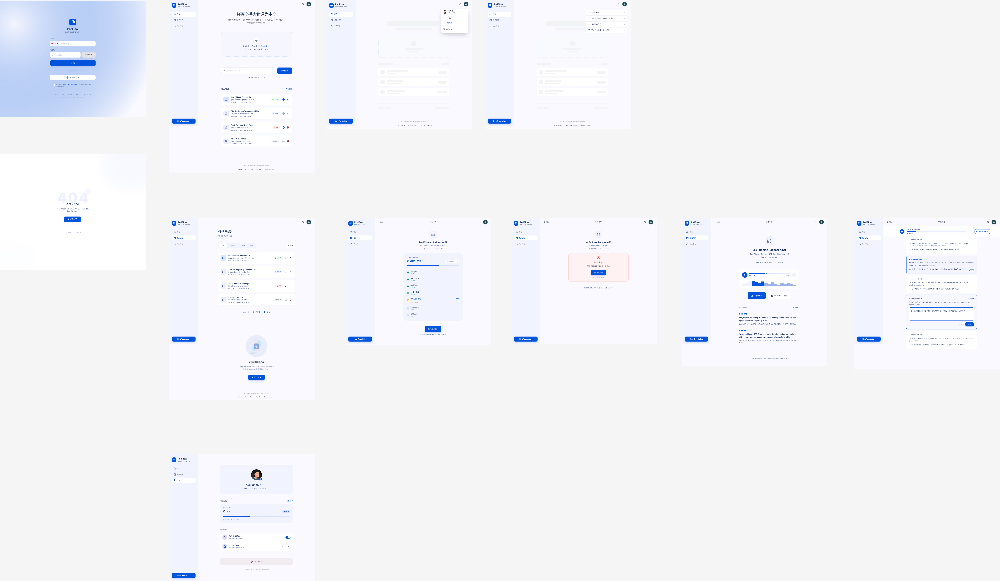
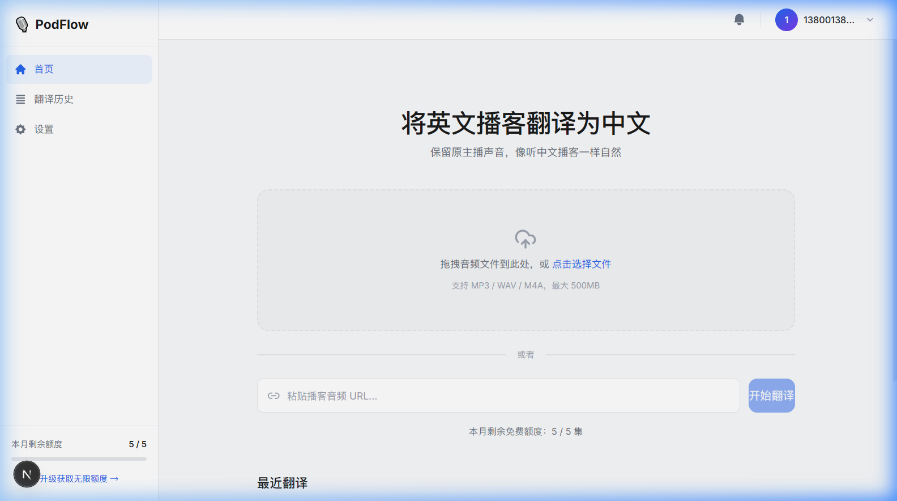
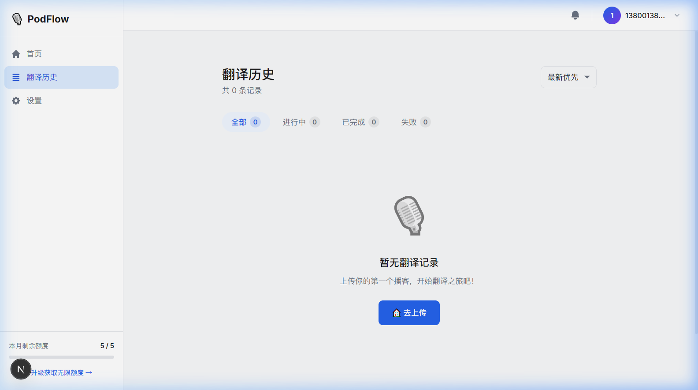
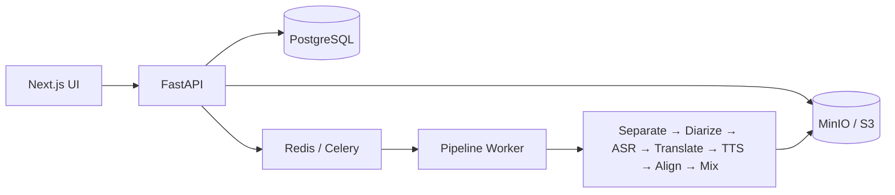

# PodFlow

[](https://github.com/RomyMing/podflow/actions/workflows/ci.yml)

PodFlow 是一个端到端的 AI 播客翻译作品集项目：上传外语播客后，系统完成音轨分离、说话人识别、语音转写、文本翻译、授权声纹合成、时间轴对齐与混音，生成可播放和下载的翻译版音频。

本仓库是从私有开发仓库审查后导出的公开源码快照，不包含原始 Git 历史、部署环境、线上服务或容器镜像。源码可见不等于开源；使用范围见 [LICENSE](LICENSE)。

[English](#english) · [快速开始](#快速开始mock-模式) · [真实链路](#real-模式) · [文档索引](#文档索引) · [安全与责任](#安全与责任)



## 产品能力

- 短信登录、本地 Mock 验证码、音频上传、异步任务与实时进度。
- 7 阶段音频处理链路，支持多说话人转写和分段处理。
- ElevenLabs、VoxCPM、CosyVoice 三种语音合成路径。
- 阶段级 checkpoint、产物复用、worker 心跳与中断续跑。
- Provider 密钥按用户加密保存，额度或凭据异常时暂停而不丢进度。
- FastAPI + Celery + PostgreSQL + Redis + MinIO 后端，以及 Next.js 前端。

| 首页 | 任务列表 |
| --- | --- |
|  |  |

## 系统概览



真实链路依次执行：

1. Demucs 分离人声与背景声。
2. pyannote.audio 进行说话人分离。
3. faster-whisper 完成语音识别。
4. DeepSeek 完成文本翻译。
5. ElevenLabs、VoxCPM 或 CosyVoice 生成授权配音。
6. FFmpeg 对齐时间轴。
7. pydub/FFmpeg 混回背景声并输出 MP3。

更完整的运行时说明见 [应用架构](podcast_translator/ARCHITECTURE.md)。

## 快速开始（Mock 模式）

Mock 模式不需要 GPU 或任何第三方 AI 密钥，适合从全新克隆体验完整产品流程。输出音频是源文件的占位副本，不执行真实翻译。

准备 Docker Desktop 或兼容的 Docker Compose，然后运行：

```bash
git clone https://github.com/RomyMing/podflow.git
cd podflow/podcast_translator
cp .env.example .env
docker compose up --build
```

打开 `http://localhost:8080`，使用验证码 `123456` 登录，上传一段测试音频并等待任务完成。

- 后端健康检查：`http://localhost:8000/health`
- MinIO 控制台：`http://localhost:9001`
- 本地 MinIO 账号：`admin` / `minio_password`（仅示例环境）

停止并清理本地容器：

```bash
docker compose down -v
```

## Real 模式

真实链路需要 Docker，并按所选能力准备：

- DeepSeek API key：文本翻译。
- Hugging Face token：pyannote 模型访问；使用前须接受对应模型条款。
- ElevenLabs API key、DashScope API key 或可运行 VoxCPM 的 GPU：语音合成三选一。
- FFmpeg 及足够的 CPU/GPU、内存和磁盘空间。CPU 可以验证流程，但长音频处理会很慢。

```bash
cd podcast_translator
cp .env.real.example .env.real
docker compose --env-file .env.real \
  -f docker-compose.yml \
  -f docker-compose.real.yml \
  up -d --build
```

`.env.real` 中的值仅用于本地运行，绝不能提交。Provider 密钥可在登录后的“个人中心 → API 管理”中配置，也可作为系统级环境变量提供。VoxCPM/GPU 配置见 [本地真实链路指南](LOCAL_REAL_PIPELINE.md)；生产相关文档仅作为历史设计资料保留，本仓库不执行部署。

## 开发与验证

后端要求 Python 3.11，前端要求 Node.js 20。

```bash
cd podcast_translator
python -m pip install -e '.[dev]'
ruff check src tests
pytest

cd frontend
npm ci
npm run build
```

公开 CI 在每次 `main` push 和 Pull Request 上执行后端 lint/完整测试与前端生产构建，不读取外部服务密钥。真实链路 Smoke Workflow 只能由维护者手动启动，付费 Provider 预检默认关闭。

## 已知限制

- 当前没有在线 Demo、托管 API、公开容器镜像或生产部署。
- Mock 模式只验证产品流程，不生成翻译音频。
- Real 模式依赖第三方模型/API、各自的访问条件、额度和服务可用性。
- 语音质量、分段和时间对齐效果会受到语言、噪声、多人重叠和录音质量影响。
- 微信登录仍为占位能力；本地短信登录默认使用 Mock。

## 文档索引

- [应用 README](podcast_translator/README.md)：应用配置、接口与本地开发。
- [当前架构](podcast_translator/ARCHITECTURE.md)：服务边界和数据流。
- [Real Pipeline Runbook](LOCAL_REAL_PIPELINE.md)：真实链路本地运行。
- [部署环境参考](podcast_translator/DEPLOY_ENV.md)：历史部署配置参考，不代表公开托管。
- [设计与实施历史](brain/README.md)：PRD、架构、UI、实现计划和过程记录的索引。
- [第三方说明](THIRD_PARTY_NOTICES.md)：仓库代码与运行时外部模型/API 的边界。
- [贡献说明](CONTRIBUTING.md) · [安全策略](SECURITY.md)

## 安全与责任

语音克隆或声音模仿只能用于已获得说话人明确授权、且用户拥有合法处理权的音频。禁止将 PodFlow 用于冒充、欺诈、骚扰、规避身份验证、误导公众，或处理无权使用的内容。使用者需要遵守适用法律、平台规则和第三方模型/API 条款，并对输入、输出及发布行为负责。

发现安全问题请使用 GitHub 的私密漏洞报告，不要公开披露凭据或漏洞细节。详见 [SECURITY.md](SECURITY.md)。

## 版权

Copyright © 2026 RomyMing — All Rights Reserved.

本仓库未授予复制、修改、分发、商业使用、部署服务或创建衍生作品的许可。第三方组件仍受其各自许可和服务条款约束。详见 [LICENSE](LICENSE) 与 [THIRD_PARTY_NOTICES.md](THIRD_PARTY_NOTICES.md)。

---

## English

PodFlow is an end-to-end AI podcast translation portfolio project. It separates audio, identifies speakers, transcribes speech, translates text, synthesizes authorized voices, aligns the timeline, and mixes the translated speech back with the background audio.

This repository is a reviewed source snapshot exported from a private development repository. It contains no previous Git history, deployment environment, hosted service, or public container image. Source availability does not make it open source; see [LICENSE](LICENSE).

### Quick start

The default Mock mode requires Docker only. It exercises login, upload, task processing, progress, playback, and download without calling an AI provider.

```bash
git clone https://github.com/RomyMing/podflow.git
cd podflow/podcast_translator
cp .env.example .env
docker compose up --build
```

Open `http://localhost:8080` and sign in with the Mock verification code `123456`. Mock mode returns a placeholder copy of the source audio; it does not perform translation.

Real mode additionally requires accepted pyannote model access, translation credentials, a supported voice provider or local VoxCPM runtime, and sufficient compute. Follow [LOCAL_REAL_PIPELINE.md](LOCAL_REAL_PIPELINE.md) and never commit a populated environment file.

### Project status

`v0.1.0` is a portfolio release. Issues are open for bug reports and feedback, but external code pull requests are not currently accepted. There is no hosted demo, production deployment, GHCR image, or warranty.

Voice cloning is permitted only with the speaker's explicit authorization and lawful rights to the source audio. Impersonation, fraud, deception, and unauthorized content processing are prohibited.

Copyright © 2026 RomyMing — All Rights Reserved.
