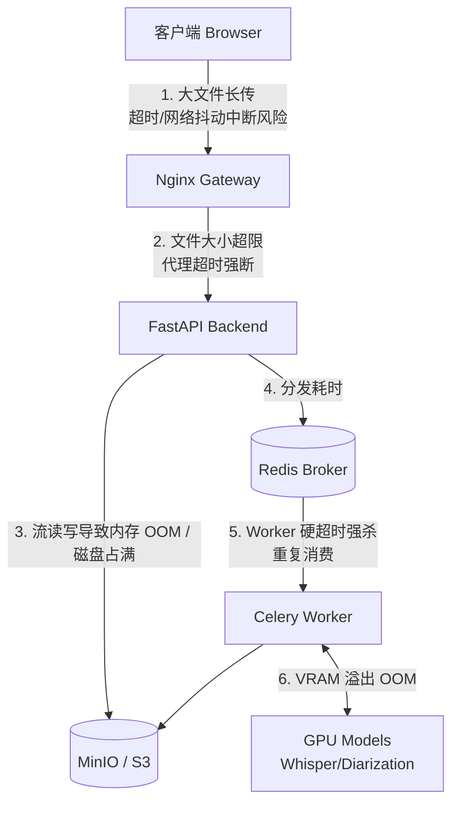

# 超长音视频处理适配指南 (120分钟支持)

针对 120 分钟时长的音视频（文件大小通常在 `500MB` 至 `2GB+` 之间，处理耗时可能长达数小时），单纯修改前端的 `timeout` 只能解决客户端自动取消请求的问题。为了保证全链路的稳定，需要进行系统的“水桶扩容”。

以下是从网络层到 AI 基础设施的专项优化建议及实操清单。

## 全链路瓶颈分析



---

## 1. 🌐 网关与网络层 (Nginx)

> [!WARNING]
> 一旦前端设置长达 120 分钟的超时限制，网关往往会成为第一个截断请求拦截点。

**排查与优化项：**
- **增加最大负载 (`client_max_body_size`)**：默认往往只有 `1M` 或 `50M`，需提升以支撑 2GB 的高清音频/低清视频盲传。
- **调整代理超时配置 (`proxy_timeout`)**：Nginx 的各种读写超时默认只有 `60s`。

**参考配置示例 (`nginx.conf`)：**
```nginx
server {
    client_max_body_size 5000M;            # 放宽最大体积至 5GB
    proxy_connect_timeout 7200s;           # 上游连接超时
    proxy_send_timeout 7200s;              # 发送响应超时
    proxy_read_timeout 7200s;              # 接收请求超时
}
```

## 2. ⚡ 后端应用层 (FastAPI / Uvicorn)

> [!IMPORTANT]
> 绝对禁止将 1GB 的文件通过 `await file.read()` 一次性读入内存，同时处理 3 个任务就会导致服务器崩溃。

**排查与优化项：**
- **强制使用分块写入流式传输（Streaming Chunk）**：
  在接收路由中使用 `file.file.read(CHUNK_SIZE)`，边收边写盘，或直接通过流对象上传到 MinIO。
- **保持活跃 (Keep-Alive)**：在 Uvicorn 启动参数中，检查 `--timeout-keep-alive` 参数是否能应对长时间的低速网络传输。

## 3. 🧠 异步任务队列 (Celery)

> [!CAUTION]
> AI 模型推理 120 分钟音频时，若队列调度存在默认超时（通常是分钟级），进程将被 `SIGKILL` 强杀。

**排查与优化项：**
- **修改极限时间 (`task_time_limit`)**：
  确保软超时 (`soft_time_limit`) 足够长以便安全回收资源，硬超时 (`time_limit`) 设置为极端兜底值（例如 5 小时）。
- **确认消费幂等性 (`acks_late`)**：
  启用 `acks_late=True` 和 `worker_prefetch_multiplier=1`。超长音频会长期占有一个 worker 单节点，让任务在安全完成（翻译生成结束）后再向 Broker 回执，防止因假死引起的异常重试（这会让重试节点也处于堵塞状态）。

## 4. 💽 存储与 GPU 资源护城河

> [!CAUTION]
> 资源消耗不会完全呈线性增长，长时间音频的矩阵长度极易引发灾难性后果。

**排查与优化项：**
- **存储预警机制**：120 分钟音频将产生大量的原音频文件、不同音轨的隔离音频以及切分的 WAV 碎片，极吃 `MinIO` 与宿主机的 `/tmp` 目录容量。建议设定 CRON 脚本进行定期清理，或配置 S3 的过期规则（Lifecycle Rules）。
- **GPU 显存控制 (VRAM)**：
  - **切片策略**：如果直接丢入 Faster-Whisper 或分离模型，内存/显存必爆。应当在任务执行入口将 120 分钟切分成 `10 分钟` 为单位的小块（Chunks），分别循环推理后再把文本合并。
  - **Batch Size 降级**：适当降低模型推理时的并发与批处理大小。

## 5. 💻 前端交互与体验升级 (UX)

> [!TIP]
> 极其不建议让用户干等前端一个 2 小时的 `timeout` 去挂机。断站必重来的体验会造成极高的流失率。

**后续迭代规划方案：**
1. **分片上传 (Resumable Chunked Upload)**：
   引入类似 [Uppy](https://uppy.io/) 或自行基于 `File.slice()` 分片。每 5MB 上传一次并获取校验。即使用户电脑短时断网刷新也能从断点继续上传。
2. **强感知的多阶段进度条反馈**：
   WebSocket 应透传更多明确颗粒度的阶段信息（如 `上传完成 80%` -> `音轨分离分析中 25%` -> `内容听写中 40%` 等）。确保 UI 提供可靠的假死防范设计。
